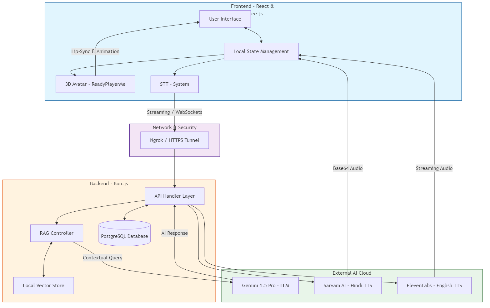

# TechEx AI 2026 - Voice-Enabled Interactive Assistant

TechEx AI is a cutting-edge, voice-first interactive assistant designed for the 2026 Technology Exhibition. It combines high-performance 3D visuals, real-time RAG (Retrieval Augmented Generation), and seamless multi-language speech synthesis.

## 🏗️ System Architecture

The following diagram illustrates the complete end-to-end flow of the application. This was generated using the Mermaid CLI library.



### Key Components

- **Frontend**: Built with React and Three.js for a premium 3D experience. Features a ReadyPlayerMe avatar with dynamic lip-sync and animations.
- **RAG Implementation**: Uses a custom `LocalVectorStore` to index exhibition-specific documents, providing Gemini with factual context to reduce hallucinations.
- **Speech Stack**:
    - **STT**: Universal streaming recognition for seamless interaction.
    - **TTS**: High-fidelity voices from ElevenLabs (English) and Sarvam AI (Hindi) for a natural conversational experience.
- **Database**: PostgreSQL manages user sessions, conversation history, and technical configurations.

---

## 🛠️ Setup & Running

1. **Install Dependencies**:
   ```bash
   bun install
   ```

2. **Environment Variables**:
   Create a `.env` file with the following:
   - `VITE_GEMINI_API_KEY`: Google Gemini Pro Key
   - `VITE_SARVAM_API_KEY`: Sarvam AI Hindi TTS Key
   - `VITE_ELEVENLABS_API_KEY`: ElevenLabs English Voice Key
   - `DATABASE_URL`: PostgreSQL Connection String

3. **Run Development Server**:
   ```bash
   bun run dev
   ```

---

## 🚀 Deployment

The project is optimized for deployment on **Railway** or **Cloud Run**.
- Uses a multi-stage `Dockerfile` for efficient builds.
- Automatically initializes the PostgreSQL schema on first run.
- Zero-credentials persistence (handles keys via environment variables).
- **Public Access**: Use `npx ngrok http 3000` for secure HTTPS tunneling to local development.
